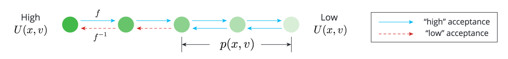

# A-NICE-MC: Adversarial Training for MCMC

**A-NICE-MC** is a framework that trains a *parametric* Markov Chain Monte Carlo proposal.
It achieves higher performance than traditional nonparametric proposals, such as Hamiltonian Monte Carlo (HMC). 
This repository provides code to replicate the experiments, as well as providing grounds for further research.

A-NICE-MC stands for *Adversarial Non-linear Independent Component Estimation Monte Carlo*, in that:
- The framework utilizes a parametric proposal for Markov Chain Monte Carlo (MC).
- The proposal is represented through Non-linear Independent Component Estimation (NICE).
- The NICE network is trained through adversarial methods (A); see [jiamings/markov-chain-gan](https://github.com/jiamings/markov-chain-gan).

Work by [Jiaming Song](tsong.me), [Shengjia Zhao](szhao.me) and [Stefano Ermon](cs.stanford.edu/~ermon).

## Running the Experiments
The code depends on tensorflow >= 1.0, numpy, scipy, matplotlib.
It has been tested on Python 2.7.

The Effective Sample Size metric for evaluating MCMC algorithms will appear on screen, and is stored in `logs/[experiment_name]/ess.csv`.

### Analytical Expression Targets

To run the Ring experiment:
```
python examples/nice_ring2d.py
```

To run the Mixture of Gaussian experiment:
```
python examples/nice_mog.py
```

### Bayesian Logistic Regression Posterior Inference

To run the experiment on Australian dataset:
```
python examples/nice_australian.py
```

## How A-NICE-MC Works
In general, [Markov Chain Monte Carlo](https://en.wikipedia.org/wiki/Markov_chain_Monte_Carlo) methods estimate a density `p(x)` by sampling through a Markov Chain, where the transition kernel has two components:
- A proposal `p(x_|x)` that proposes a new `x_` given the previous `x`. The proposal should satisfy [detailed balance](https://en.wikipedia.org/wiki/Detailed_balance).
- A [Metropolis-Hastings](https://en.wikipedia.org/wiki/Metropolis%E2%80%93Hastings_algorithm) acceptance step, which accepts or rejects `x_` according to `p(x)` and `p(x_)`.

It might be tempting to use any generative model as the proposal; however, training is difficult because the kernel is non-differentiable, and score-based gradient estimator
are not effective when initially the rejection rate is high.

Therefore, we draw ideas from [Hamiltonian Monte Carlo](https://arxiv.org/pdf/1206.1901.pdf) and [NICE](https://arxiv.org/abs/1410.8516).
NICE is a *deterministic, invertible* transformation that preserves volume; HMC introduces an auxiliary variable that reduces random walk behavior.

### A NICE Proposal

We can therefore use a NICE network `x_, v_ = f(x, v)` as our proposal, where `v` is the auxiliary variable we sample independently from `x` at every step.
Hence, we can treat `f(x, v)` as some "implicit generative model", which can be used to construct `p(x_|x)`.

We use the following proposal to ensure `p(x_, v_|x, v) = p(x, v|x_, v_)` for all `(x, v)` and `(x_, v_)` pairs,
thereby satisfying the *detailed balance* condition directly.
- For `p = 0.5`, `x_, v_ = f(x, v)`
- For `p = 0.5`, `x_, v_ = f^{-1}(x, v)`

### Training

Then, we can utilize adversarial training to train the Markov Chain from `f(x, v)` (not the proposal), 
thereby making the entire objective differentiable.

> Wait! How can you train on a differentiable model that is totally different from the MCMC kernel that you sample from?



Due to the invertibility of the NICE network, if the forward operation tranforms a point in the `(x, v)` manifold to another point in the `(x, v)` manifold, then the backward operation will do the same. Meanwhile, the forward operation will encourage the points to move toward `p(x, v)` and the MH step tends to reject backward operations, thereby removing random-walk behavior.

### Increasing ESS with Pairwise Discriminator

Ideally we would like to reduce autocorrelation between the samples from the chain. 
This can be done by simply providing a pair of correlated data to the discriminator as generated data, so that the generator has the incentive to generate samples that are less correlated.

Suppose two settings of generation:

- `x -> z1`
- `z -> z2 -> stop_gradient(z2) -> z3`

where `x` is the "true data", `z` is the starting distribution, and `z1`, `z2`, and `z3` are the distribution that are generated by the model. In the case if pairwise discriminator, we consider the two type of pairs: `(x, z1)` and `(z2, z3)`. The optimal solution for the generator (given a perfect discriminator) is to let `p(z1), p(z2), p(z3)` to be the data distribution and `z2` and `z3` are uncorrelated.

## Contact
[tsong@cs.stanford.edu](mailto:tsong@cs.stanford.edu)
